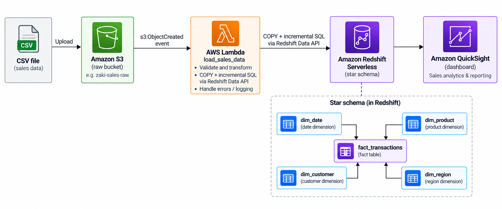

# Data Warehouse + BI Layer — zaki-warehouse-bi

Project 4: a star-schema data warehouse on Redshift Serverless, loaded incrementally from S3, with a
QuickSight dashboard calculating real KPIs.

## Problem and constraints

- **Data volume:** small, synthetic sales transaction data (currently ~110
  rows across 3 load batches) — intentionally small enough to verify
  correctness by hand, while the pipeline is built to scale to real volumes.
- **Latency:** near real-time. Rather than a scheduled nightly batch, new
  data is loaded the moment a CSV file lands in S3.
- **Consumers:** a BI dashboard (QuickSight) used to answer "what's our
  revenue and units sold, and how is it trending month-on-month, broken down
  by product/region/time period."
- **Correctness requirement:** re-uploading or re-processing the same file
  must never double-count a transaction — the load must be idempotent.

## Architecture

All infrastructure (S3 bucket, Lambda, Redshift Serverless namespace/workgroup,
IAM roles) is defined in Terraform (`terraform/modules/warehouse`), deployed
to separate `dev` and `prod` environments, via a GitHub Actions pipeline that
runs `terraform plan` on every pull request and `terraform apply`
automatically on merge to `main` (`.github/workflows/terraform.yml`).

## Alternatives considered

**Star schema vs. one flat table.** A single wide table would repeat product/
customer/region text on every transaction row, risking inconsistent spelling
and bloating storage. The star schema stores descriptive text once per
dimension and links to it via small integer keys.

**Incremental load vs. full refresh.** A full reload would either duplicate
every transaction on each run (inflating every KPI) or require a slow
truncate-and-reload that leaves the table briefly empty. Incremental loading
(dedup by `transaction_id` on every load) keeps load time roughly constant
and never leaves downstream consumers looking at an empty or duplicated
table.

**Event-driven Lambda load vs. a scheduled batch job.** An S3 upload event
triggering the Lambda directly gives near-real-time loading with very little
orchestration code. The trade-off: there's no built-in retry queue or
dead-letter handling for a failed load (that pattern exists in Project 3's
streaming pipeline) — if the Lambda fails, the file has to be re-uploaded
manually to retry.

**IAM policy: full enumeration vs. a scoped wildcard.** The GitHub Actions
deploy role lists every individual S3 action needed (`s3:GetBucketAcl`,
`s3:GetBucketCORS`, etc.) rather than granting `s3:*` on the project's
buckets. This is more precise and auditable, at the cost of discovering each
required action one `AccessDenied` error at a time during CI runs — see
below.

## What broke, and how it was fixed

Building the least-privilege CI role surfaced a pattern worth documenting on
its own: **Terraform's `aws_s3_bucket` resource reads far more than you'd
expect on every `plan`/`apply`.** It checks ACLs, CORS rules, website
config, transfer acceleration, requester-pays, logging, lifecycle rules,
replication, and object-lock settings — on every refresh, regardless of
whether you've configured any of them. Each missing permission surfaced as
its own `AccessDenied` error in CI, one at a time; each one was added to the deploy role's policy as it appeared.

## Data quality

`tests/data_quality_checks.py` runs 7 checks against the live warehouse via
the Redshift Data API: no duplicate `transaction_id`, no fact rows with a
foreign key missing from its dimension table (checked for all 4 dimensions),
`revenue` consistently equals `quantity * unit_price`, and the fact table
isn't empty. All 7 currently pass.

## How to run it

**Prerequisites:** an AWS account, Terraform >= 1.10, and the GitHub Actions
OIDC role set up (trust policy scoped to this repo only — see the shared CI
role recipe).

1. **Bootstrap** (one-time, run locally with your own AWS credentials, never
   via CI):    This creates the Terraform state bucket and the GitHub Actions deploy
   role.

2. **Deploy the warehouse infrastructure:** open a PR touching `terraform/**`
   — this triggers `plan-dev`/`plan-prod` in CI. Once those pass and the PR
   is merged to `main`, `apply-dev` then `apply-prod` run automatically.

3. **Load data:** upload a CSV file matching the schema in
   `sql/create_tables.sql` to the raw S3 bucket (`zaki-warehouse-bi-<env>-raw-<account-id>`).
   This automatically triggers the Lambda to load it into Redshift.

4. **Verify data quality:**
   Requires AWS credentials with `redshift-data:ExecuteStatement`,
   `redshift-data:DescribeStatement`, `redshift-data:GetStatementResult`,
   and `redshift-serverless:GetCredentials` on the target workgroup.

5. **View the dashboard:** the QuickSight dashboard connects to the `dev`
   Redshift Serverless workgroup, with filters by product, region, and time
   period.

   

   

   